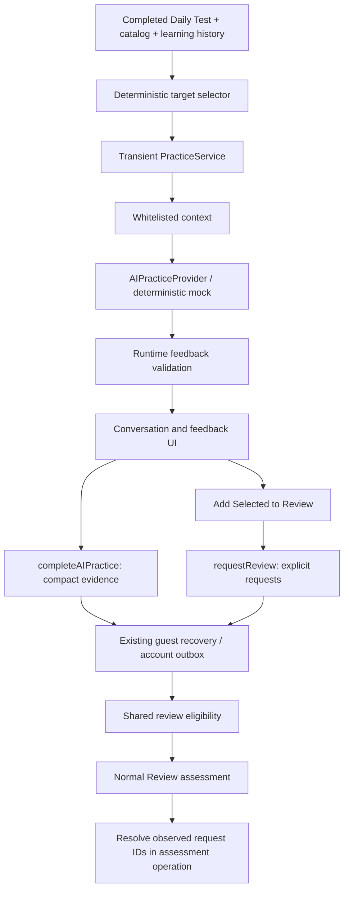

# Mock AI practice and persistent learning evidence

Daily Test completion offers **Practice with AI**, alongside the existing Start another test and View Learned actions. All three modes use typed input in this phase. The screen identifies the provider as a mock; no AI service, microphone, transcription, provider key, or billing is involved. Account persistence uses the existing Supabase synchronization service. Guests and accounts can both use the mock, including offline.

## Architecture



New modules in `src/aiPractice/`:

| Module | Responsibility |
| --- | --- |
| `practiceModel.ts` | Modes, target/turn/feedback/session types, allowed transitions, derived progress |
| `targetWordSelector.ts` | Pure, deterministic selection from a completed quiz |
| `contextBuilder.ts` | Explicit provider-safe vocabulary and learning projection |
| `provider.ts` | Provider-neutral asynchronous contract |
| `mockProvider.ts` | Scripted prompts, phrase recognition, bounded example corrections |
| `feedbackValidator.ts` | Runtime trust boundary and locally derived recommendations |
| `practiceService.ts` | Observable in-memory state, deterministic answer checks, cancellation, orchestration |
| `reviewRequest.ts` | Original transient selection helper; no persistence access |
| `learningEvidence.ts` | Compact whitelist, parsers, stable confirmation IDs and monotonic lifecycle |
| `persistence.ts` | Application command interface and durability result |
| `AIPractice.tsx` | Mode setup and typed practice UI |
| `PracticeFeedback.tsx` | Automatic evidence checkpoint, explicit review confirmation, saving and retry states |

`App.tsx` coordinates entry from `DailyTest.tsx`. No new state library is used. `PracticeService` follows the existing subscription/getSnapshot convention, and React uses `useSyncExternalStore`. Its constructor accepts a provider, clock, and ID generator. It has no repository, storage, authentication, or sync dependency.

## Selection and snapshots

Select at most eight distinct words from completed quiz results which are still present in the current catalog. Selection does not expand into unrelated vocabulary. Fewer than five candidates are valid; zero candidates leaves a return-to-results message.

Priority is incorrect typed answers, weak words, newly learned words, due words, then other correct answers. Weak means directional difficulty above 50, or prior misses with fewer than two consecutive Known assessments, matching the existing adaptive selection criteria. Ties use descending directional difficulty, quiz order, then ID. Time is an explicit input.

Targets preserve quiz direction and a deep copy of the frozen question snapshot, including accepted answers and strict/legacy matching rule. Later edits do not rewrite what this practice was based on. Deleted/hidden targets invalidate active practice. Existing `selectQuestions`, scoring, Known/Didn't know assessment, history, and review scheduling are unchanged. Difficulty labels remain New/Easy/Medium/Hard/Very Hard and do not represent CEFR proficiency.

## Context and provider boundaries

`buildPracticeContext` constructs each property explicitly. It includes target IDs, English, Turkish meanings, English alternatives, optional example/part of speech, direction, difficulty, quiz evidence, and relevant directional counters. It excludes account IDs, auth tokens, queue contents, devices, unrelated words, tags, and full history.

The provider receives that context plus finalized learner/tutor turns. Turn identifiers allow evidence references; turn text is user-supplied content, not trusted instructions. A future provider must treat vocabulary examples and learner text as data too. This structural whitelist cannot prevent a learner from voluntarily typing personal information.

`AIPracticeProvider.prepare` returns an untrusted tutor message; `respond` returns an untrusted message and full per-target feedback; `finish` returns untrusted final feedback. Calls accept an abort signal; disposal releases provider resources. There are no SDK types. Use `AIPractice`'s optional `providerFactory` prop for test injection; production currently always constructs `MockPracticeProvider`.

## Mock semantics and validation

Voice Answer bypasses provider evaluation entirely and uses existing `questionMatches`, including Turkish spelling, alternate meanings, phrases, and historical matching rules. Before submission, the UI hides answer-bearing target labels. There is no speech capture.

Use the Word prompts for an English sentence. Conversation uses short contextual cues for a small known vocabulary set and a generic situation prompt for other words. Whole-phrase, Unicode-aware boundaries prevent substring matches; explicit English alternatives are recognized. Each response is associated with the prompted target, and may also demonstrate other selected words. The next prompt moves to an unattempted target.

Feedback separates retrieval (`recognized`, `missing`, `unassessed`), semantics (`acceptable`, `inappropriate`, `unassessed`), and grammar (`correct`, `needsCorrection`, `unassessed`). Summary outcomes are `correct`, `partial`, `needsPractice`, or `notAttempted`.

**Correct retrieval is not a claim that an arbitrary sentence is semantically or grammatically correct.** The mock generally leaves both dimensions unassessed. A supported “I want achieve my goal(s)” example recognizes vocabulary and semantic usage while proposing “want to achieve.” A supported “I achieve to school” example demonstrates partial vocabulary usage and a separate vocabulary correction. These are scripted examples, not general language analysis. Mock recognition does not stem words or infer synonyms.

`validateFeedback` validates every provider result before it reaches UI state. It requires exactly one outcome per target; rejects unknown/non-target IDs, duplicate outcomes, invalid enums, oversized/malformed fields, unsupported evidence and corrections, contradictory success/failure states, and unsafe review recommendations. Evidence must name finalized learner turns; correction originals must occur in that evidence. Extra properties are stripped. Counts and suggested IDs are derived locally. Only partial/needsPractice vocabulary outcomes suggest review; a grammar-only issue does not.

Validation establishes structural consistency, not factual certainty. Future provider evaluations remain fallible and cannot directly alter learning records.

## Lifecycle, persistence, and review requests

Preparation transitions to ready. Submission transitions through processing back to ready. Ending validates feedback, then Finish completes the session. Cancellation/failure are terminal. Listening and tutorSpeaking statuses are reserved for future adapters. Duplicate/in-flight submissions are ignored; abort/disposal prevents late provider responses from updating state.

Practice is limited to eight targets, at most sixteen learner turns, and 2,000 characters per response. Only finalized turns enter service state; drafts remain React state. Progress derives from validated outcomes. Source changes, navigation, account-scope changes, target removal, and unmount dispose the active service. Existing pronunciation stops on entry. Reload does not resume mock practice; the completed quiz remains intact.

### Durable checkpoints and privacy

Learning state **7** adds `learningEpoch`, `aiEvidence` and `reviewRequests`. Versions 1–6 load with empty AI collections and epoch zero. Malformed new records are dropped independently; malformed word references cannot discard valid vocabulary, quiz or history records. Historical evidence does not recreate deleted vocabulary.

`Application.completeAIPractice` revalidates finalized feedback, selects a compact whitelist and saves once per practice-session UUID. The persisted record contains the source quiz UUID (nullable for historical sessions), completion time, mode, evaluator `mock`, epoch, and at most eight word/direction outcomes with retrieval, semantics, grammar and a suggested flag. It excludes turns, typed practice answers, explanations, corrections, strengths, prompts and audio. Existing deterministic quiz answers retain their existing storage behavior. A grammar-only correction cannot suggest vocabulary review.

**Add Selected to Review** calls `Application.requestReview` only after evidence is durable. Selected suggestions must occur in saved evidence and the current vocabulary. Each confirmation keeps a stable UUID, word, direction, timestamp, source, practice UUID, epoch and lifecycle (`active`, `resolved`, `cancelled`). UUIDs are deterministically derived with SHA-256 from the practice UUID and immutable target position, so confirmations agree across devices even when local numeric word IDs differ. Separate sessions retain separate provenance; one session/word/direction cannot create a second confirmation. Accepted suggestions are derived from linked requests, never written back into immutable evidence.

Both commands capture the account/guest scope and reset epoch. State updates happen before asynchronous durability waits, so concurrent duplicate submissions reuse the same record and operation. Failed writes retain in-memory selections and operations; Retry persists those same identities. A refresh before a failed save succeeds can lose that unsaved work, and the UI says so. Leaving after success retains the compact records; practice conversations are still discarded.

Guests use the existing recovery envelope and compatible localStorage keys. Accounts use the existing IndexedDB cache and outbox, atomically storing the projection and pending operation. A resolved command means **locally durable**, not necessarily uploaded: the UI distinguishes saved on this device, awaiting sync, and synchronized results. Account status continues to show later synchronization progress/errors. No partial turn, draft or streaming write exists. One completed practice creates one `ai-complete` operation; one explicit confirmation batch creates one `review-request` operation. Both are non-coalescing event barriers. Assessment resolution shares the ordinary `assess` operation.

### Eligibility, ordering and resolution

`reviewEligibility.ts` combines unchanged history scheduling with active requests. Review, navigation counts, current Needs Review badges, catalog filters and dashboard attention counts use this projection. Daily Test selection and all difficulty/mastery calculations remain unchanged. A request is immediately eligible; its timestamp is the effective deadline unless normal history supplies an earlier one.

Multiple active requests collapse into one item per word/direction and each Review session contains a word once. Among eligible directions, unresolved misses win, then higher directional difficulty, earlier effective deadline, and English → Turkish. Queue order retains misses first, migrated eligibility next, other due words next and upcoming words last. Request-only entries appear in Needs Review with “Suggested by AI Practice.” An active session's questions never expand when another request arrives; its other eligible direction remains for a later session.

At self-assessment, `assessReviewState` captures exactly the active request IDs visible for that word/direction in the finalized result. Both Known and Didn’t know resolve those IDs. A miss stays due through existing history rules. Daily Test, opening/starting Review, cancelling practice and AI feedback cannot resolve requests. The server validates the observed IDs against the successfully accepted Review assessment in the same transaction as history, activity and question advancement.

Unseen requests survive regardless of timestamps or delivery order. Active creation replay cannot replace a terminal request. Concurrent accepted assessments choose the lexicographically smallest resolving event UUID as deterministic resolution metadata; the assessment event retains its original timestamp. Cancellation dominates resolution, which dominates active state. Concurrent confirmation timestamps merge to their minimum without changing immutable provenance. Optimistic replay uses the same lifecycle rules.

### Deletion, reset and import

Deleting/hiding vocabulary cancels requests immediately; ordinary restoration does not reactivate them. Short Undo restores the pre-deletion snapshot/unsent operation. Server cleanup includes requests absent from the deleting device's cache. Compact evidence stays as history. Reset-progress and clear-all remove evidence/requests and advance the epoch. AI commands from earlier epochs conflict and remain in the established recovery workflow rather than resurrecting learning state.

Guest import keeps the existing preview, identity linking, revision checks, dataset receipts and conflict handling. Every evidence/request word reference is explicitly mapped to `b:<ID>` or `u:<UUID>`; practice, request and assessment UUIDs never enter vocabulary-ID conversion. Imported records adopt the destination epoch, retain stable record IDs and merge lifecycle monotonically. Imported resolved requests require linked Review result evidence. A dataset receipt prevents reimporting the same dataset after reset. Sign-out/account switching retain existing isolated caches.

### Database and client rollout

Apply **`supabase/migrations/006_ai_practice_review.sql` after 005 and before deploying this client**. No live database migration was performed. Source quiz references must identify a completed Daily Test owned by the account. Evidence operations depend on unresolved source-quiz operations, and application commands restrict writes to their exact checkpoint keys. The migration adds validated `ai-evidence/` and `review-request/` namespaces in existing `account_records`; it adds no vocabulary database or second queue. It reuses profile-row locks, operation receipts, ownership checks and RLS, validates bounded batches and compact enums, and makes evidence/request operations atomic. Untrusted clients still cannot prove linguistic correctness: SQL validation establishes structure/ownership and lifecycle consistency, not authentic model evaluation.

Synchronization protocol is **5**; serialized account caches are **6**. IndexedDB remains database/store version 1 with the same `accounts` store. Cache upgrades retain `:pre-v6` backups and original attempted payloads. Protocol-5 snapshots expose the authoritative `profiles.reset_epoch` as validated `learning/epoch` metadata. Epoch zero and an absent legacy cell compare equivalently in diffs.

The client uses `kelime_apply_v5`, `kelime_snapshot_v5`, `kelime_reconcile_v5` and `kelime_compact_drafts_v5`. After adoption, old mutation endpoints are blocked under the profile lock. The new endpoint accepts preserved legacy queue operations without rewriting their attempted payloads or attaching request resolution to old assessments. Migration-005 conflict classification, receipt reconciliation and draft-chain validation remain in force. Older endpoints keep their previous behavior on accounts not yet upgraded. `npm run db:types` regenerates the checked-in database types from executable migrations.

## Future voice and real AI

A future adapter can attach microphone/transcription events to the reserved listening/speaking states and submit finalized transcripts through the same service. Keep partial transcripts, tokens, audio chunks, and connection state transient. Avoid overlapping existing pronunciation with recording.

Real provider implementation requires a trusted authenticated backend, server-side secrets, bounded usage, timeout/shutdown behavior, and official API documentation verification at implementation time. Browser credentials, if needed, must be temporary. No permanent key belongs in Vite variables. No provider API names or model choices are assumed here.

## Development and checks

No new dependencies or environment variables are needed to run the mock:

```sh
npm ci
npm run dev
npm test
npm run lint
npm run build
npm run test:browser
npx playwright test --config=playwright.ai.config.ts
```

Use a Node build with native TypeScript support (the README's Node 22.18+ or Node 24 requirement). Some system Node builds disable TypeScript support even when their version is recent enough.

Playwright retains the repository's default `msedge` channel. Machines with Chromium instead can install the matching version and select it explicitly:

```sh
npx playwright install chromium
PLAYWRIGHT_CHANNEL=chromium npm run test:browser
PLAYWRIGHT_CHANNEL=chromium npx playwright test --config=playwright.ai.config.ts
```

`tests/aiPractice.test.mjs` continues to verify the storage-free provider/service boundary, matching, validation and mock limitations. `tests/aiPersistence.test.mjs` covers compact whitelisting, independent recovery, identity mapping, command durability/retry, IndexedDB reload, scope isolation, eligibility, observed resolution, lifecycle replay, Undo and import. `tests/aiPersistenceSql.test.mjs` exercises migration 005→006, RLS, atomic validation failures, concurrent Review sessions, unseen requests, terminal replay, reset epochs, compatibility, receipts and import provenance.

`tests/pwa/aiPractice.spec.ts` exercises all three modes in the production build, asserts zero writes before End Practice and only recovery-envelope learning writes at the two durable checkpoints, checks unchanged mastery/quiz results, reloads requests into normal Review and resolves them by self-assessment. Keyboard focus, 320px layout and Axe checks remain. `playwright.ai.config.ts` uses a development-only fixture for provider failure and evidence/request storage failures with retries; no production failure controls exist.

## Persistence-phase delivery report

Real AI, microphone capture, transcription, provider endpoints/secrets, billing and persisted conversation/resume remain out of scope. Mock judgments remain scripted and limited; only compact outcomes and explicit requests are retained.

Created files:

```text
src/aiPractice/learningEvidence.ts
src/aiPractice/persistence.ts
src/reviewEligibility.ts
supabase/migrations/006_ai_practice_review.sql
tests/aiPersistence.test.mjs
tests/aiPersistenceSql.test.mjs
```

Modified files:

```text
AI_PRACTICE.md
PWA_SETUP.md
README.md
SUPABASE_SETUP.md
scripts/generate-db-types.mjs
src/App.tsx
src/DailyTest.tsx
src/PracticeQuestion.tsx
src/Review.tsx
src/WordDifficulty.tsx
src/aiPractice/AIPractice.tsx
src/aiPractice/PracticeFeedback.tsx
src/catalogQuery.ts
src/dailyTestModel.ts
src/data/accountStore.ts
src/data/application.ts
src/data/cloudRepository.ts
src/data/codec.ts
src/data/database.types.ts
src/data/eventProjection.ts
src/data/localRepository.ts
src/data/migration.ts
src/data/models.ts
src/data/queueMigration.ts
src/data/syncService.ts
src/learningState.ts
src/progressModel.ts
src/reviewModel.ts
src/vocabularyManagement.ts
tests/adaptiveLearning.test.mjs
tests/ai-browser/failure.spec.ts
tests/browser/aiPractice.tsx
tests/dbHarness.mjs
tests/offline.test.mjs
tests/progress.test.mjs
tests/pronunciation.test.mjs
tests/pwa/aiPractice.spec.ts
tests/pwa/app.spec.ts
tests/review.test.mjs
tests/syncReliability.test.mjs
```

Final verification (2026-09-20):

| Command/check | Result |
| --- | --- |
| `npm test` with Node 24 on PATH | All 20 test files passed, including PGlite migration/security/regression tests; no skips |
| Persistence domain and SQL coverage | 15 domain tests and 9 SQL scenarios, including application-generated operations synchronized end to end |
| `npm run lint` | Passed, no warnings |
| `npm run build` | TypeScript and production/PWA build passed |
| `npm run db:types` with Node 24 | Regenerated successfully from all six migrations |
| `PLAYWRIGHT_CHANNEL=chromium npm run test:browser -- tests/pwa/aiPractice.spec.ts` | All 5 targeted production tests passed |
| `PLAYWRIGHT_CHANNEL=chromium npm run test:browser` | All 16 production browser tests passed on final run |
| `PLAYWRIGHT_CHANNEL=chromium npx playwright test --config=playwright.ai.config.ts` | All 4 isolated failure/retry tests passed |
| Accessibility/mobile | Axe, keyboard/focus, 320px overflow checks and feedback screenshot inspection passed |
| `git diff --check` | Passed |

The system Node 22 runtime was not used for native TypeScript unit tests; the available Node 24 binary was placed on PATH. Chromium was used through the existing channel override; Edge and physical mobile devices were not tested. Local browser-server execution required sandbox permission, which was granted. There are no unresolved verification blockers. Dependencies were already installed; package manifests and lockfiles are unchanged.

An initial production run exposed a test selector that still targeted desktop navigation after changing to mobile width; the test now exercises Mobile navigation. An existing pronunciation assertion now polls for its already-asynchronous scheduled callback instead of racing it. No assertions were removed or skipped.

No live Supabase project was contacted or migrated, and the client was not deployed. Apply migration 006 before deployment. Work stops at compact persistence and explicit Review integration; real provider/voice work remains a separate phase.
