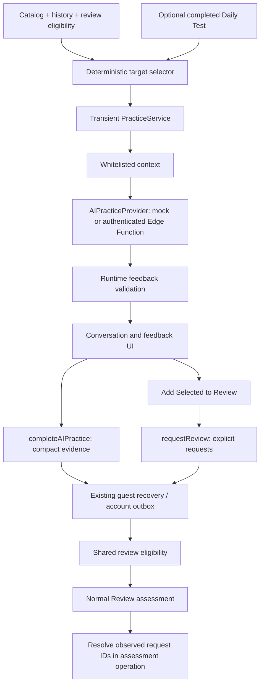

# AI Practice: independent text and realtime voice

**Daily Test** and **AI Practice** are independent navigation choices. AI Practice starts from automatic or manually selected vocabulary without creating or completing a quiz. Daily Test remains the standard deterministic quiz; its optional post-results shortcut still uses frozen quiz snapshots. On mobile, both paths are directly available and Progress is in More.

Mock remains the default, including offline guest use. Use the Word and Conversation — Text support the existing allowlisted OpenAI text pilot. **Translation Check (typed)** replaces the misleading Voice Answer label while preserving the `voiceAnswer` stored enum and local matching. **Conversation — Voice** is a separately disabled pilot using GPT-Live 1. Validated completion saves compact evidence; only explicit Add Selected to Review creates review requests. Known/Missed, difficulty, scheduling and sync protocol remain unchanged.

## Independent selection and contracts

`PracticeStart` contains frozen targets, nullable `sourceQuizId`, provenance (`automatic`, `manual`, `quizFollowup`) and input modality. `PracticeService` retains the legacy quiz constructor path and accepts independent starts. `buildPracticeContext` omits quiz evidence when none exists. The backend accepts both context forms and never receives the catalog, account identity or sync state as model input.

Automatic selection considers both directions per available word: active requests/normal review eligibility; existing weakness rule (difficulty above 50, or misses with fewer than two consecutive Known assessments); recent misses; newly learned completed-quiz evidence; practiced words untouched for seven days; untested vocabulary; remaining words. Recent means seven days. Sort by priority, descending existing directional difficulty, oldest last assessment/attempted AI evidence timestamp, numeric word ID, then English→Turkish. Select one direction per word, at most eight. No fabricated first-learned dates or new mastery counters. Manual selection is searchable, optional, 1–8 distinct available words, and uses the same direction ranking. A session's targets stay fixed.

## Realtime voice architecture — Phase 5B

Official documentation checked **2026-09-21**. Chosen model: `gpt-live-1`; transport: browser WebRTC; voice: `marin`; explicit `store:false`; client delegation with no tools or automatic Responses delegation.

| Candidate | Current documented pricing | Decision |
| --- | --- | --- |
| [GPT-Live 1](https://developers.openai.com/api/docs/models/gpt-live-1) | $0.05 per connected minute, per-second billing; backend separate | Chosen for full-duplex conversation, natural interruptions, duration accounting and frontend event permissions. |
| [GPT-Realtime-2.1](https://developers.openai.com/api/docs/models/gpt-realtime-2.1) | Audio $32 input/$64 output per million tokens; text $4/$24 | Stronger integrated reasoning/tools, unnecessary for this bounded conversation with separate evaluation. |
| [GPT-Realtime-2.1 Mini](https://developers.openai.com/api/docs/models/gpt-realtime-2.1-mini) | Audio $10/$20 per million; text $0.60/$2.40 | Lower-cost Realtime alternative; not an automatic fallback. |
| [GPT-Realtime-2](https://developers.openai.com/api/docs/models/gpt-realtime-2) | Audio $32/$64 per million; text $4/$24 | Older alternative to 2.1, not selected. |

The authenticated `ai-practice` function handles `voiceAvailability`, `voiceCreate`, and owner-bound `voiceClose`. It independently validates bounded context, finalized history, IDs and SDP, reserves cost transactionally, creates the Live session using its server key, attaches trusted sideband supervision, then returns only SDP and deadline. Browser audio flows directly to OpenAI. No reusable OpenAI key/client secret enters the browser. Frontend data-channel commands are disabled; only input/output transcript deltas and error events are forwarded, excluding configuration/instructions. Server-selected settings cannot be replaced by request fields. Unsupported delegations receive a fixed, non-paid redirect back to practice.

[WebRTC guidance](https://developers.openai.com/api/docs/guides/voice-webrtc), [server controls](https://developers.openai.com/api/docs/guides/voice-server-controls), [Live session lifecycle](https://developers.openai.com/api/docs/guides/live-conversations), [client delegation](https://developers.openai.com/api/docs/guides/live-delegation), [Live API reference](https://developers.openai.com/api/reference/typescript/resources/live/methods/create).

### Microphone, turn handling and recovery

Permission is requested only on Start Voice. States distinguish requesting/granted/denied/unavailable/device error. Supported browser echo cancellation, noise suppression and automatic gain are requested without custom DSP. An exclusive pronunciation lease stops and suppresses normal pronunciation while the voice screen is mounted. Media tracks, playback, timers, listeners and connections are released on cancellation, navigation, account change, reset or target removal.

Live supplies native full-duplex turn handling; Realtime `server_vad`/`semantic_vad` settings are intentionally not applied. Mute and keyboard/pointer push-to-talk provide a fallback. WebRTC audio-level statistics drive approximate activity labels, not assessment or turn finalization. Native Live handles conversational interruption; captions are not proof that all tutor audio played. The actual device/acoustic behavior remains a live pilot gate.

Transcript fragments are deduplicated and sorted by provider timeline, independently per speaker. Same-speaker fragments less than one second apart are grouped, bounded to 2,000 learner / 1,500 tutor characters. These groups are application display segments, not provider-guaranteed conversational turns. More than 16 learner segments or 33 total segments ends capture without silently evaluating overflow. At End Practice, microphone/playback stop, the server closes the session, and the user reviews heard text. Excluded segments and tutor captions do not enter final evaluation. Recognized text cannot be rewritten in this phase.

`VoiceSession` and `browserVoiceConnector` are injectable. Only the existing structured text evaluator (`gpt-5.6-terra`) plus shared validators can produce final feedback. Repeated feedback actions preserve finalized learner IDs and logical request identity. Reconnect is explicit, requires confirmed previous closure, obtains a new reservation/connection, and seeds bounded in-memory history. It cannot restore audio or guarantee perfect continuation. Failed authorization and uncertain closures never trigger automatic paid retries. Text practice remains available.

### Cost, operational privacy and shutdown

Pilot: two-minute deadline from reservation, one active session/account, three globally, three creation attempts/minute/account and four/day/account. Each connection reserves $0.20 (including the initialization/shutdown margin); final text evaluation reserves separately. Text and voice share $1/account/day and $10/global/day UTC budgets under the same transactional lock. Reported voice seconds reconcile costs with a 15-second initialization minimum; unknown usage retains the reservation.

A trusted sideband deadline and authenticated minute cleanup endpoint enforce shutdown independently of the browser. Availability requires a cleanup heartbeat within 90 seconds and no overdue/uncertain sessions. The cleanup process also removes operational records after seven days. If an unresolved connection reaches retention age, only a non-identifying blocked safety latch remains; an operator must investigate before clearing it. A creation response lost before a provider ID is known cannot be automatically reconciled: the reservation remains charged and voice fails closed. No exactly-once billing or hard invoice cap is promised.

The native Deno WebSocket implementation must support Authorization headers and the deployed runtime must support `EdgeRuntime.waitUntil`. Worker lifetime alone is not a guarantee: [Supabase limits](https://supabase.com/docs/guides/functions/limits) require the independent scheduler. No healthy scheduler means no pilot. Conservative reservations cannot guarantee costs during a simultaneous provider/control-plane outage.

Operational tables contain only IDs, keyed fingerprints, model, lifecycle/deadline and usage/cost. No SDP, credentials, audio, transcript, prompts, raw responses or reasoning are logged/stored. `store:false` disables Live recording/fork storage, not separate OpenAI abuse monitoring. [Data controls](https://developers.openai.com/api/docs/guides/your-data) currently describe 30-day abuse-monitoring retention for Live; do not claim zero provider retention.

### Evidence migration and compatibility

Migration **008_independent_ai_voice.sql** adds server-only voice controls and version-2 compact evidence metadata (`schemaVersion`, `provenance`, `inputModality`). Voice uses existing mode `conversation`, evaluator `openai`, and the existing completion/review commands. Independent sourceQuizId is null. Legacy records retain their exact shape; no backfill or fabricated quiz. Learning state 7, cache format 6 and sync protocol 5 are unchanged. Existing explicit word-reference codecs/import remapping preserve metadata and UUID identities. Server immutable-record checks prevent older clients from overwriting new evidence after stripping unfamiliar fields; clients should update together. Migrations 006/007 are unchanged.

### Operator steps (not executed)

1. Keep `VITE_AI_PRACTICE_PROVIDER=mock` and `AI_PRACTICE_VOICE_ENABLED=false` during setup. Apply migrations through 008 with `supabase db push` only after selecting/reviewing the intended project.
2. Configure a server-only env file: existing `OPENAI_API_KEY`, `AI_PRACTICE_ENABLED`, `AI_PRACTICE_ALLOWED_USER_IDS`, `AI_PRACTICE_ALLOWED_ORIGINS`, `AI_PRACTICE_HASH_KEY`, plus `AI_PRACTICE_VOICE_ENABLED=false` and random `AI_PRACTICE_CLEANUP_SECRET` (at least 32 characters). Supabase supplies URL/service credentials. No OpenAI/cleanup secret uses a VITE prefix.
3. Operator commands: `supabase secrets set --env-file <server-only-file>` then `supabase functions deploy ai-practice`. Keep gateway JWT verification enabled.
4. In Supabase Vault, configure `kelime_project_url`, `kelime_service_role_key`, `kelime_voice_cleanup_secret`. Run the reviewed [scheduler SQL](scripts/configure-voice-cleanup.sql) as an administrator. It sends the service-role bearer plus the cleanup secret to `/functions/v1/ai-practice/cleanup` each minute. Verify HTTP 204 and fresh health metadata. Do not grant operational tables/RPCs to browsers.
5. Deploy the updated client. For the allowlisted test environment only, expose real selection with `VITE_AI_PRACTICE_PROVIDER=openai` and enable the server voice flag after the non-paid checks pass. Run the separate [opt-in live evaluation checklist](VOICE_EVALUATION.md). Keep the public pilot disabled until real supervision, acoustic quality and cost checks pass. This implementation did not deploy, expand the allowlist, send real audio, or run paid evaluations.

The following sections document the existing text/persistence architecture and earlier phase verification; the independent entry and voice behavior above supersede historical post-quiz-only descriptions.

## Architecture



New modules in `src/aiPractice/`:

| Module | Responsibility |
| --- | --- |
| `practiceModel.ts` | Modes, target/turn/feedback/session types, allowed transitions, derived progress |
| `targetWordSelector.ts` | Pure, deterministic selection from a completed quiz |
| `contextBuilder.ts` | Explicit provider-safe vocabulary and learning projection |
| `provider.ts` | Provider-neutral asynchronous contract |
| `mockProvider.ts` | Scripted prompts, phrase recognition, bounded example corrections |
| `feedbackValidator.ts` | Runtime trust boundary and locally derived recommendations |
| `practiceService.ts` | Observable in-memory state, deterministic answer checks, cancellation, orchestration |
| `reviewRequest.ts` | Original transient selection helper; no persistence access |
| `learningEvidence.ts` | Compact whitelist, parsers, stable confirmation IDs and monotonic lifecycle |
| `persistence.ts` | Application command interface and durability result |
| `AIPractice.tsx` | Mode setup and typed practice UI |
| `PracticeFeedback.tsx` | Automatic evidence checkpoint, explicit review confirmation, saving and retry states |

`App.tsx` coordinates entry from `DailyTest.tsx`. No new state library is used. `PracticeService` follows the existing subscription/getSnapshot convention, and React uses `useSyncExternalStore`. Its constructor accepts a provider, clock, and ID generator. It has no repository, storage, authentication, or sync dependency.

## Quiz follow-up selection and snapshots

Select at most eight distinct words from completed quiz results which are still present in the current catalog. Selection does not expand into unrelated vocabulary. Fewer than five candidates are valid; zero candidates leaves a return-to-results message.

Priority is incorrect typed answers, weak words, newly learned words, due words, then other correct answers. Weak means directional difficulty above 50, or prior misses with fewer than two consecutive Known assessments, matching the existing adaptive selection criteria. Ties use descending directional difficulty, quiz order, then ID. Time is an explicit input.

Targets preserve quiz direction and a deep copy of the frozen question snapshot, including accepted answers and strict/legacy matching rule. Later edits do not rewrite what this practice was based on. Deleted/hidden targets invalidate active practice. Existing `selectQuestions`, scoring, Known/Didn't know assessment, history, and review scheduling are unchanged. Difficulty labels remain New/Easy/Medium/Hard/Very Hard and do not represent CEFR proficiency.

## Context and provider boundaries

`buildPracticeContext` constructs each property explicitly. It includes target IDs, English, Turkish meanings, English alternatives, optional example/part of speech, direction, difficulty, quiz evidence, and relevant directional counters. It excludes account IDs, auth tokens, queue contents, devices, unrelated words, tags, and full history.

The provider receives that context plus finalized learner/tutor turns. Turn identifiers allow evidence references; turn text is user-supplied content, not trusted instructions. The OpenAI adapter treats vocabulary examples and learner text as data too, beneath immutable server instructions. This structural whitelist cannot prevent a learner from voluntarily typing personal information.

`AIPracticeProvider.prepare` returns an untrusted tutor message; `respond` returns an untrusted message and full per-target feedback; `finish` returns untrusted final feedback. Calls accept an abort signal; disposal releases provider resources. There are no SDK types. Use `AIPractice`'s optional `providerFactory` prop for test injection; production defaults to `MockPracticeProvider` and offers `OpenAIPracticeProvider` only after authenticated availability succeeds. `loadTransport` is an injected availability boundary used by isolated browser fixtures.

## Mock semantics and validation

Voice Answer bypasses provider evaluation entirely and uses existing `questionMatches`, including Turkish spelling, alternate meanings, phrases, and historical matching rules. Before submission, the UI hides answer-bearing target labels. There is no speech capture.

Use the Word prompts for an English sentence. Conversation uses short contextual cues for a small known vocabulary set and a generic situation prompt for other words. Whole-phrase, Unicode-aware boundaries prevent substring matches; explicit English alternatives are recognized. Each response is associated with the prompted target, and may also demonstrate other selected words. The next prompt moves to an unattempted target.

Feedback separates retrieval (`recognized`, `missing`, `unassessed`), semantics (`acceptable`, `inappropriate`, `unassessed`), and grammar (`correct`, `needsCorrection`, `unassessed`). Summary outcomes are `correct`, `partial`, `needsPractice`, or `notAttempted`.

**Correct retrieval is not a claim that an arbitrary sentence is semantically or grammatically correct.** The mock generally leaves both dimensions unassessed. A supported “I want achieve my goal(s)” example recognizes vocabulary and semantic usage while proposing “want to achieve.” A supported “I achieve to school” example demonstrates partial vocabulary usage and a separate vocabulary correction. These are scripted examples, not general language analysis. Mock recognition does not stem words or infer synonyms.

`validateFeedback` validates every provider result before it reaches UI state. It requires exactly one outcome per target; rejects unknown/non-target IDs, duplicate outcomes, invalid enums, oversized/malformed fields, unsupported evidence and corrections, contradictory success/failure states, and unsafe review recommendations. Evidence must name finalized learner turns; correction originals must occur in that evidence. Extra properties are stripped. Counts and suggested IDs are derived locally. Only partial/needsPractice vocabulary outcomes suggest review; a grammar-only issue does not.

Validation establishes structural consistency, not factual certainty. Real provider evaluations remain fallible and cannot directly alter learning records.

## Lifecycle, persistence, and review requests

Preparation transitions to ready. Submission transitions through processing back to ready. Ending validates feedback, then Finish completes the session. Cancellation and mock failures are terminal. OpenAI failures enter `retryable`; retry repeats the logical action with the same finalized learner turn. End Practice can request fresh final feedback from that state. Listening and tutorSpeaking statuses are reserved for future adapters. Duplicate/in-flight submissions are ignored; abort/disposal prevents late provider responses from updating state.

Practice is limited to eight targets, at most sixteen learner turns, and 2,000 characters per response. Only finalized turns enter service state; drafts remain React state. Progress derives from validated outcomes. Source changes, navigation, account-scope changes, target removal, and unmount dispose the active service. Existing pronunciation stops on entry. Reload does not resume mock practice; the completed quiz remains intact.

### Durable checkpoints and privacy

Learning state **7** adds `learningEpoch`, `aiEvidence` and `reviewRequests`. Versions 1–6 load with empty AI collections and epoch zero. Malformed new records are dropped independently; malformed word references cannot discard valid vocabulary, quiz or history records. Historical evidence does not recreate deleted vocabulary.

`Application.completeAIPractice` revalidates finalized feedback, selects a compact whitelist and saves once per practice-session UUID. The persisted record contains the source quiz UUID (nullable for historical sessions), completion time, mode, evaluator `mock`, `openai`, or `deterministic`, epoch, and at most eight word/direction outcomes with retrieval, semantics, grammar and a suggested flag. It excludes turns, typed practice answers, explanations, corrections, strengths, prompts and audio. Existing deterministic quiz answers retain their existing storage behavior. A grammar-only correction cannot suggest vocabulary review.

**Add Selected to Review** calls `Application.requestReview` only after evidence is durable. Selected suggestions must occur in saved evidence and the current vocabulary. Each confirmation keeps a stable UUID, word, direction, timestamp, source, practice UUID, epoch and lifecycle (`active`, `resolved`, `cancelled`). UUIDs are deterministically derived with SHA-256 from the practice UUID and immutable target position, so confirmations agree across devices even when local numeric word IDs differ. Separate sessions retain separate provenance; one session/word/direction cannot create a second confirmation. Accepted suggestions are derived from linked requests, never written back into immutable evidence.

Both commands capture the account/guest scope and reset epoch. State updates happen before asynchronous durability waits, so concurrent duplicate submissions reuse the same record and operation. Failed writes retain in-memory selections and operations; Retry persists those same identities. A refresh before a failed save succeeds can lose that unsaved work, and the UI says so. Leaving after success retains the compact records; practice conversations are still discarded.

Guests use the existing recovery envelope and compatible localStorage keys. Accounts use the existing IndexedDB cache and outbox, atomically storing the projection and pending operation. A resolved command means **locally durable**, not necessarily uploaded: the UI distinguishes saved on this device, awaiting sync, and synchronized results. Account status continues to show later synchronization progress/errors. No partial turn, draft or streaming write exists. One completed practice creates one `ai-complete` operation; one explicit confirmation batch creates one `review-request` operation. Both are non-coalescing event barriers. Assessment resolution shares the ordinary `assess` operation.

### Eligibility, ordering and resolution

`reviewEligibility.ts` combines unchanged history scheduling with active requests. Review, navigation counts, current Needs Review badges, catalog filters and dashboard attention counts use this projection. Daily Test selection and all difficulty/mastery calculations remain unchanged. A request is immediately eligible; its timestamp is the effective deadline unless normal history supplies an earlier one.

Multiple active requests collapse into one item per word/direction and each Review session contains a word once. Among eligible directions, unresolved misses win, then higher directional difficulty, earlier effective deadline, and English → Turkish. Queue order retains misses first, migrated eligibility next, other due words next and upcoming words last. Request-only entries appear in Needs Review with “Suggested by AI Practice.” An active session's questions never expand when another request arrives; its other eligible direction remains for a later session.

At self-assessment, `assessReviewState` captures exactly the active request IDs visible for that word/direction in the finalized result. Both Known and Didn’t know resolve those IDs. A miss stays due through existing history rules. Daily Test, opening/starting Review, cancelling practice and AI feedback cannot resolve requests. The server validates the observed IDs against the successfully accepted Review assessment in the same transaction as history, activity and question advancement.

Unseen requests survive regardless of timestamps or delivery order. Active creation replay cannot replace a terminal request. Concurrent accepted assessments choose the lexicographically smallest resolving event UUID as deterministic resolution metadata; the assessment event retains its original timestamp. Cancellation dominates resolution, which dominates active state. Concurrent confirmation timestamps merge to their minimum without changing immutable provenance. Optimistic replay uses the same lifecycle rules.

### Deletion, reset and import

Deleting/hiding vocabulary cancels requests immediately; ordinary restoration does not reactivate them. Short Undo restores the pre-deletion snapshot/unsent operation. Server cleanup includes requests absent from the deleting device's cache. Compact evidence stays as history. Reset-progress and clear-all remove evidence/requests and advance the epoch. AI commands from earlier epochs conflict and remain in the established recovery workflow rather than resurrecting learning state.

Guest import keeps the existing preview, identity linking, revision checks, dataset receipts and conflict handling. Every evidence/request word reference is explicitly mapped to `b:<ID>` or `u:<UUID>`; practice, request and assessment UUIDs never enter vocabulary-ID conversion. Imported records adopt the destination epoch, retain stable record IDs and merge lifecycle monotonically. Imported resolved requests require linked Review result evidence. A dataset receipt prevents reimporting the same dataset after reset. Sign-out/account switching retain existing isolated caches.

### Database and client rollout

Apply **`supabase/migrations/006_ai_practice_review.sql` after 005 and before deploying this client**. No live database migration was performed. Source quiz references must identify a completed Daily Test owned by the account. Evidence operations depend on unresolved source-quiz operations, and application commands restrict writes to their exact checkpoint keys. The migration adds validated `ai-evidence/` and `review-request/` namespaces in existing `account_records`; it adds no vocabulary database or second queue. It reuses profile-row locks, operation receipts, ownership checks and RLS, validates bounded batches and compact enums, and makes evidence/request operations atomic. Untrusted clients still cannot prove linguistic correctness: SQL validation establishes structure/ownership and lifecycle consistency, not authentic model evaluation.

Synchronization protocol is **5**; serialized account caches are **6**. IndexedDB remains database/store version 1 with the same `accounts` store. Cache upgrades retain `:pre-v6` backups and original attempted payloads. Protocol-5 snapshots expose the authoritative `profiles.reset_epoch` as validated `learning/epoch` metadata. Epoch zero and an absent legacy cell compare equivalently in diffs.

The client uses `kelime_apply_v5`, `kelime_snapshot_v5`, `kelime_reconcile_v5` and `kelime_compact_drafts_v5`. After adoption, old mutation endpoints are blocked under the profile lock. The new endpoint accepts preserved legacy queue operations without rewriting their attempted payloads or attaching request resolution to old assessments. Migration-005 conflict classification, receipt reconciliation and draft-chain validation remain in force. Older endpoints keep their previous behavior on accounts not yet upgraded. `npm run db:types` regenerates the checked-in database types from executable migrations.

## Historical voice roadmap (superseded by Phase 5B above)

A future adapter can attach microphone/transcription events to the reserved listening/speaking states and submit finalized transcripts through the same service. Keep partial transcripts, tokens, audio chunks, and connection state transient. Avoid overlapping existing pronunciation with recording.

Phase 5A implements the trusted text backend described below. Future voice must retain these privacy and validation boundaries. No permanent provider key belongs in Vite variables.

## Development and checks

No new dependencies or environment variables are needed to run the mock:

```sh
npm ci
npm run dev
npm test
npm run lint
npm run build
npm run test:browser
npx playwright test --config=playwright.ai.config.ts
```

Use a Node build with native TypeScript support (the README's Node 22.18+ or Node 24 requirement). Some system Node builds disable TypeScript support even when their version is recent enough.

Playwright retains the repository's default `msedge` channel. Machines with Chromium instead can install the matching version and select it explicitly:

```sh
npx playwright install chromium
PLAYWRIGHT_CHANNEL=chromium npm run test:browser
PLAYWRIGHT_CHANNEL=chromium npx playwright test --config=playwright.ai.config.ts
```

`tests/aiPractice.test.mjs` continues to verify the storage-free provider/service boundary, matching, validation and mock limitations. `tests/aiPersistence.test.mjs` covers compact whitelisting, independent recovery, identity mapping, command durability/retry, IndexedDB reload, scope isolation, eligibility, observed resolution, lifecycle replay, Undo and import. `tests/aiPersistenceSql.test.mjs` exercises migration 005→006, RLS, atomic validation failures, concurrent Review sessions, unseen requests, terminal replay, reset epochs, compatibility, receipts and import provenance.

`tests/pwa/aiPractice.spec.ts` exercises all three modes in the production build, asserts zero writes before End Practice and only recovery-envelope learning writes at the two durable checkpoints, checks unchanged mastery/quiz results, reloads requests into normal Review and resolves them by self-assessment. Keyboard focus, 320px layout and Axe checks remain. `playwright.ai.config.ts` uses a development-only fixture for provider failure and evidence/request storage failures with retries; no production failure controls exist.

## Historical persistence-phase delivery report

At the end of the persistence phase, real AI, microphone capture, transcription, provider endpoints/secrets, billing and persisted conversation/resume were outside scope. Phase 5A below supersedes the real-text-provider limitation. Mock judgments remain scripted and limited; only compact outcomes and explicit requests are retained.

Created files:

```text
src/aiPractice/learningEvidence.ts
src/aiPractice/persistence.ts
src/reviewEligibility.ts
supabase/migrations/006_ai_practice_review.sql
tests/aiPersistence.test.mjs
tests/aiPersistenceSql.test.mjs
```

Modified files:

```text
AI_PRACTICE.md
PWA_SETUP.md
README.md
SUPABASE_SETUP.md
scripts/generate-db-types.mjs
src/App.tsx
src/DailyTest.tsx
src/PracticeQuestion.tsx
src/Review.tsx
src/WordDifficulty.tsx
src/aiPractice/AIPractice.tsx
src/aiPractice/PracticeFeedback.tsx
src/catalogQuery.ts
src/dailyTestModel.ts
src/data/accountStore.ts
src/data/application.ts
src/data/cloudRepository.ts
src/data/codec.ts
src/data/database.types.ts
src/data/eventProjection.ts
src/data/localRepository.ts
src/data/migration.ts
src/data/models.ts
src/data/queueMigration.ts
src/data/syncService.ts
src/learningState.ts
src/progressModel.ts
src/reviewModel.ts
src/vocabularyManagement.ts
tests/adaptiveLearning.test.mjs
tests/ai-browser/failure.spec.ts
tests/browser/aiPractice.tsx
tests/dbHarness.mjs
tests/offline.test.mjs
tests/progress.test.mjs
tests/pronunciation.test.mjs
tests/pwa/aiPractice.spec.ts
tests/pwa/app.spec.ts
tests/review.test.mjs
tests/syncReliability.test.mjs
```

Final verification (2026-09-20):

| Command/check | Result |
| --- | --- |
| `npm test` with Node 24 on PATH | All 20 test files passed, including PGlite migration/security/regression tests; no skips |
| Persistence domain and SQL coverage | 15 domain tests and 9 SQL scenarios, including application-generated operations synchronized end to end |
| `npm run lint` | Passed, no warnings |
| `npm run build` | TypeScript and production/PWA build passed |
| `npm run db:types` with Node 24 | Regenerated successfully from all six migrations |
| `PLAYWRIGHT_CHANNEL=chromium npm run test:browser -- tests/pwa/aiPractice.spec.ts` | All 5 targeted production tests passed |
| `PLAYWRIGHT_CHANNEL=chromium npm run test:browser` | All 16 production browser tests passed on final run |
| `PLAYWRIGHT_CHANNEL=chromium npx playwright test --config=playwright.ai.config.ts` | All 4 isolated failure/retry tests passed |
| Accessibility/mobile | Axe, keyboard/focus, 320px overflow checks and feedback screenshot inspection passed |
| `git diff --check` | Passed |

The system Node 22 runtime was not used for native TypeScript unit tests; the available Node 24 binary was placed on PATH. Chromium was used through the existing channel override; Edge and physical mobile devices were not tested. Local browser-server execution required sandbox permission, which was granted. There are no unresolved verification blockers. Dependencies were already installed; package manifests and lockfiles are unchanged.

An initial production run exposed a test selector that still targeted desktop navigation after changing to mobile width; the test now exercises Mobile navigation. An existing pronunciation assertion now polls for its already-asynchronous scheduled callback instead of racing it. No assertions were removed or skipped.

No live Supabase project was contacted or migrated, and the client was not deployed. Apply migration 006 before deployment. That delivery stopped at compact persistence and explicit Review integration. The Phase 5A delivery follows.

## Phase 5A: trusted real text tutoring

The browser `OpenAIPracticeProvider` implements the existing provider contract. `providerConnection` binds authenticated requests to the account that passed availability; account changes reject subsequent calls. `PracticeService` controls evaluator identity, logical request UUIDs, and finalized learner turns. Retries preserve that turn and logical UUID and allocate a new attempt UUID only on an explicit user action. There is no automatic paid retry or silent fallback. Cancel, navigation, scope changes and disposal abort the request and ignore late results. The backend and browser have 30- and 35-second deadlines; expired database leases stop blocking after 45 seconds. Cancellation cannot guarantee that already dispatched provider work was free.

The Edge Function has three small modules:

- `index.ts`: environment, verified Supabase Auth user lookup, native HTTP and privileged RPC adapters. No provider SDK dependency.
- `handler.ts`: exact-origin CORS, POST/OPTIONS, anonymous denial, account allowlist, bounded body reading, deadline/abort, keyed fingerprints, transactional reservation, fixed OpenAI endpoint, sanitized errors, settlement.
- `contract.ts`: independent request whitelist, strict JSON schemas, immutable tutor instructions, Responses request construction, refusal/incomplete/JSON rejection, shared application feedback validation, token usage and conservative cost estimates.

Only selected vocabulary, its bounded quiz/history counters, and finalized turns enter the model input. Session/request/attempt/account IDs, timestamps, authentication, unrelated vocabulary, device and sync state do not. Turn UUIDs and selected word IDs remain necessary for validated evidence. Learner/vocabulary instructions are serialized as untrusted user data under separate immutable instructions; no model tools are enabled. This mitigates instruction injection but cannot establish that every contextual judgment is correct. Model output must pass the backend validator and the same service validator before display or persistence.

`gpt-5.6-terra` uses Responses with strict `text.format` JSON schema, `reasoning.effort: none`, `store: false`, `stream: false`, and at most 3,500 output tokens. All schema fields are required and objects disallow additional properties. Refusal, incomplete output, unsupported corrections, fabricated evidence IDs and contradictory results cannot reach the compact evidence command. No Conversations resources, previous response IDs, background requests or streaming drafts are used. Tutor text is capped at 1,500 characters. Application code derives review suggestions and summary counts; grammar alone cannot imply vocabulary failure.

### Server limits and operational records

| Limit | Enforcement |
| --- | --- |
| Body | 128 KiB, checked while reading, including bodies without Content-Length |
| Context | 1–8 unique targets; English/meaning/alternative fields 300 chars each, up to 16 meanings/alternatives, example 1,000 chars, part of speech 100 chars |
| Turns | 33 finalized turns, at most 16 learner turns, 2,000 chars per learner, 1,500 per tutor; valid unique UUIDs |
| Generation rate | 6 reservations/minute/user, 100/day/user, 24/session |
| Concurrency/lifetime | One unexpired in-flight reservation/user; 60-minute server-clock session lifetime |
| Logical retries | At most two reserved attempts/logical request; duplicate attempt UUIDs never redispatch during retention |
| Estimated budget | US$1/user/UTC day, US$10 globally/UTC day |
| Retention | Seven days, hourly pg_cron cleanup; cleanup also runs before reservations |

Migration 007 adds RLS-enabled, browser-inaccessible `ai_practice_sessions`, `ai_practice_attempts`, and a singleton transaction lock. Service-role-only reserve/settle RPCs serialize budget/rate checks and insert the reservation atomically. The lock is deliberately global for this small pilot. These tables never enter the account snapshot/outbox or learning data.

Reserve cost uses UTF-8 serialized request bytes as a conservative token upper bound plus 2,048 framing tokens and maximum output. The estimate includes instructions and schema. Pricing verified on 2026-09-20 is US$2/million input tokens and US$12/million output tokens; reservation and reconciliation conservatively charge input at US$2.50/million to cover the documented 1.25× cache-write rate. Reported usage reduces the reservation; unknown usage retains the full estimate. No cached-input discount is assumed. Recheck model pricing before rollout. Rates are estimated controls, not a billing guarantee.

Operational rows contain UUIDs, owner/session linkage, keyed HMAC fingerprint, model, timestamps/lease, status category, latency, available token counts and estimated microdollars. They contain no prompt, answer, raw provider response, reasoning, correction or credential. Database errors/provider text are never forwarded or logged. Infrastructure access logs and OpenAI retention have separate policies; operators must also avoid enabling request-body logging. `store: false` disables response application storage; it does **not** remove OpenAI abuse-monitoring or prompt-cache retention.

A completed duplicate attempt cannot replay its response because responses are not stored. The UI explains that explicit retry can regenerate at additional estimated cost. A lost response after a committed reservation remains charged; an unknown settlement remains conservatively charged and its lease expires. Stable payload fingerprints prevent reusing a logical ID for different content. Deduplication metadata is retained only for the stated retention period, not forever.

### Persistence compatibility

Migration 007 replaces only the compact evaluator validator from 006 and adds operational objects. Existing `mock` evidence remains valid; real sessions use `openai`, while new Voice Answer sessions use `deterministic`. Learning state stays **7**, account cache **6**, sync protocol **5**. No queue, quiz matching, mastery formula or Review-resolution rule changes. No prompts, turns or correction text are persisted. End Practice still has one compact evidence checkpoint; Add Selected to Review is still explicit; resolution is still bundled with normal Review assessment.

Older clients cannot display the new evaluator values and should update. Existing SQL namespace authorization and immutable evidence prevent ordinary old-client writes from replacing or deleting these records; explicit reset/clear-all retains its intended behavior. New evaluator values are not cryptographic proof of a model judgment—client and SQL validation establish structure and ownership, not linguistic truth.

### Deployment and live evaluation

See [Supabase setup](SUPABASE_SETUP.md#phase-5a-openai-text-pilot) for exact server variables and rollout. Apply migrations through 006, then 007; configure server secrets; deploy the function disabled; deploy the updated client; run bounded local verification; then enable only the allowlisted pilot after operator review. No live project was migrated or deployed in this work.

`node scripts/evaluate-ai-practice.mjs` requires `AI_EVAL_URL` pointing to a **local** `/functions/v1/ai-practice`, `AI_EVAL_TOKEN` for an allowlisted test account, and `AI_EVAL_ORIGIN` matching server configuration. It never calls OpenAI directly or reads an OpenAI key. Four canned English–Turkish cases check grammar/vocabulary separation, correct context, unattempted vocabulary and instruction injection. It validates all feedback/evidence and records contextual expectations separately, emits no raw text, and stops before dispatch if total conservative reservations would exceed US$1. There are no automatic retries. The backend's normal pilot limits also apply.

This environment has no server credentials or configured local Supabase backend. The evaluation command exited without calls; **live linguistic quality and hosted integration remain unverified and the pilot remains disabled**. Deno was obtained solely to type-check the Edge Function; no Supabase deploy, secrets upload or live migration command was executed. Phase 5B microphone capture, transcription, audio, Realtime, provider billing UI and persisted conversation/resume remain deferred.

### Official sources verified for Phase 5A

- [GPT-5.6 Terra model and pricing](https://developers.openai.com/api/docs/models/gpt-5.6-terra)
- [Responses text generation](https://developers.openai.com/api/docs/guides/text)
- [Strict structured outputs and refusal handling](https://developers.openai.com/api/docs/guides/structured-outputs)
- [Manual conversation state](https://developers.openai.com/api/docs/guides/conversation-state)
- [OpenAI data controls and retention](https://developers.openai.com/api/docs/guides/your-data)
- [Supabase authenticated functions](https://supabase.com/docs/guides/functions/auth-legacy-jwt)
- [Supabase server secrets](https://supabase.com/docs/guides/functions/secrets)
- [Supabase deployment](https://supabase.com/docs/guides/functions/deploy)

### Phase 5A verification and file inventory (2026-09-20)

| Command/check | Final result |
| --- | --- |
| `npm test` with Node 24 | 22 test files passed, including PGlite migrations/database/sync regressions; new provider suite has 11 cases and operational SQL suite has 5 cases |
| `npm run lint` | Passed without warnings |
| `npm run build` | TypeScript, production bundle and PWA generation passed |
| `npm run db:types` with Node 24 | Regenerated successfully from migrations 001–007 |
| `deno check --config supabase/functions/ai-practice/deno.json supabase/functions/ai-practice/index.ts` | Passed with Deno 2.9.6 |
| `PLAYWRIGHT_CHANNEL=chromium npm run test:browser` | 16 production browser tests passed |
| `PLAYWRIGHT_CHANNEL=chromium npx playwright test --config=playwright.ai.config.ts` | 8 isolated browser tests passed, including real-provider transport injection, failure/retry, cancellation, mobile/keyboard and local Voice Answer |
| `node scripts/evaluate-ai-practice.mjs` with Node 24 | Blocked before dispatch: local backend/test credentials absent; no paid calls; pilot disabled |
| `git diff --check` | Passed |

Browser tests initially exposed an exact-label selector mismatch on the Tutor chooser; it now uses the combobox accessible role/name. Assertions were retained, and the entire AI suite passed afterward. Browser servers required sandbox permission. Node 24 and Chromium were used explicitly; Deno was downloaded for Edge type checks. Package manifests/lockfiles are unchanged. The final small availability-error handler also passed the production build and lint. Hosted Auth/gateway, pg_cron scheduling and live model quality require operator verification; local PGlite tests cover SQL behavior but do not substitute for hosted configuration.

Created files (13):

```text
scripts/evaluate-ai-practice.mjs
src/aiPractice/openAIProvider.ts
src/aiPractice/providerConnection.ts
supabase/config.toml
supabase/functions/ai-practice/.env.example
supabase/functions/ai-practice/contract.ts
supabase/functions/ai-practice/deno.json
supabase/functions/ai-practice/handler.ts
supabase/functions/ai-practice/index.ts
supabase/migrations/007_ai_provider.sql
tests/ai-browser/openAI.spec.ts
tests/aiProviderSql.test.mjs
tests/openAIPractice.test.mjs
```

Modified files (15):

```text
.env.example
AI_PRACTICE.md
PWA_SETUP.md
README.md
SUPABASE_SETUP.md
src/aiPractice/AIPractice.tsx
src/aiPractice/PracticeFeedback.tsx
src/aiPractice/feedbackValidator.ts
src/aiPractice/learningEvidence.ts
src/aiPractice/practiceModel.ts
src/aiPractice/practiceService.ts
src/aiPractice/provider.ts
src/data/database.types.ts
tests/browser/aiPractice.tsx
tests/dbHarness.mjs
```

The persistence-phase implementation was preserved. The working tree was clean when Phase 5A implementation began; this inventory describes only Phase 5A changes. No live deployment or database migration was performed. Work stops at text-provider integration; Phase 5B audio/voice and persistent conversation work remain separate.

## Persistence audit and targeted fixes (2026-09-20)

This audit rechecked the persistence-phase requirements against the current implementation while preserving Phase 5A. It did not reimplement persistence, change assessment semantics, call a provider, enable the pilot, or deploy anything. Learning state remains 7, account cache 6, and synchronization protocol 5.

### Confirmed requirements and evidence

| Requirement | Implementation and verification evidence |
| --- | --- |
| Compact completion evidence, explicit request confirmation | `Application.completeAIPractice` revalidates final feedback and commits only its evidence key; `requestReview` requires durable evidence, validates selected suggestions/current vocabulary and commits only new request keys. `PracticeFeedback` saves completion once and keeps Add Selected to Review separate. Unit and production-browser tests assert checkpoint-only writes and unchanged history. |
| No transcript/draft persistence | `compactEvidence` explicitly selects outcomes, direction, evaluator, epoch and references. It excludes turns, learner answers, explanations, corrections and strengths. Provider/service tests and production browser write instrumentation verify this boundary. Existing deterministic quiz answers retain their previous behavior. |
| Guest durability and recovery | `saveLocal` writes the recovery envelope before primary keys. Commands reject failed storage writes; retries retain stable evidence/request identities. A new test interrupts the primary learning write after a successful envelope write at both checkpoints, reconstructs `Application`, and verifies complete recovery, no duplicate records, and unchanged history/activity. |
| Account durability, offline behavior and scope isolation | `IndexedAccountStore.save` resolves on transaction completion; `practiceDurable` waits for `SyncService.whenDurable` and distinguishes pending sync from synchronization. Existing tests cover failed IndexedDB writes, preserved operation IDs, reload, sign-out and captured-scope rejection. |
| Idempotent bounded outbox operations | AI completion/request operations use protocol 5 and a captured epoch, remain event barriers, and depend on source-session/evidence operations. Existing tests cover lost responses, replayed wire payloads, one operation per checkpoint/batch, and stable request IDs. A new overlapping-confirmation test verifies concurrent batches retain the union of selected suggestions once without changing mastery/activity. |
| Review eligibility and ordering | Shared eligibility combines normal scheduling and active requests for catalog filters, counts, attention indicators and Review. `reviewQueue` selects one direction per word; misses take precedence, then directional difficulty, effective deadline and English→Turkish ties. Queue groups retain misses, migrated eligibility, due entries and upcoming entries. Existing tests cover overlapping normal/request eligibility, opposite directions and fixed active question sets. |
| Authoritative observed-request resolution | `assessReviewState` captures active IDs for the assessed word/direction in the finalized Review result. Optimistic projection and SQL derive resolution from that result in the same assessment operation. SQL verifies ownership, direction, word and epoch. Existing PGlite tests cover Known and Missed, two-device assessments, unseen concurrent requests, idempotent replay, rejection of Daily Test resolution, and terminal-state preservation. |
| Versioning and malformed-record recovery | Versions 1–6 load empty AI collections and epoch zero. New records are parsed independently. Valid evidence, quiz/history and vocabulary survive malformed neighboring records. This audit tightened malformed cloud UUID rejection as described below. |
| Word identity and imports | Evidence/request word references explicitly encode/decode as `b:<ID>` or `u:<UUID>`; practice/request/assessment UUIDs are not vocabulary IDs. Existing tests cover different local numeric namespaces, linked guest imports, lifecycle merges, dataset receipts, revision checks, cross-account denial and imported resolution provenance. |
| Delete/hide, Undo, restoration and reset | Deletion cancels affected requests; server cleanup includes requests absent from the initiating cache. Ordinary restoration keeps terminal requests terminal; short Undo restores the prior state. Progress reset/clear-all remove AI records and advance the epoch; stale AI commands remain rejected through the conflict path. Existing unit/PGlite tests cover these cases and historical evidence retention without vocabulary resurrection. |
| Accurate UI success/failure | UI waits for command durability, disables duplicate pending submissions, preserves choices after failure and offers retry. Existing AI browser tests cover evidence/request failures, unchecked selections, duplicate clicks, leaving an unsaved failure and cancellation. Production tests reload requests into normal Review and resolve them by assessment. |
| Database security and compatibility | Existing migrations 006/007 retain validated namespaces, ownership/RLS, immutable evidence, transactional rollback, receipts, old-endpoint gates and legacy-queue dispatch. PGlite regression suites include populated-005 migration, cross-account denial, malformed batches, reconciliation and draft compaction. No SQL change was necessary for this audit. |

### Defect reproduced and corrected

The cloud decoder previously accepted any 36-character combination of hexadecimal digits and hyphens after `u:`. For example, 36 hyphens were accepted as a UUID, allocated a local vocabulary identity, and allowed an otherwise structurally valid historical evidence record to survive recovery.

A regression test first reproduced the failure. `localId` now requires the UUID's 8-4-4-4-12 hexadecimal group structure before allocating an identity. Three malformed forms are tested. Recovery drops the bad evidence independently, preserves valid evidence/history, and leaves the identity map unchanged. Existing valid identity round trips remain covered. No UUID-version restriction was introduced, so existing valid UUID identities remain compatible.

### Exact audit file inventory

Modified only:

- `src/data/codec.ts`: strict cloud word UUID structure validation.
- `tests/aiPersistence.test.mjs`: malformed-reference regression, interrupted guest checkpoint recovery, and concurrent overlapping confirmations (18 persistence-domain cases total).
- `AI_PRACTICE.md`: this requirements-to-evidence audit and completion record.

No files or migrations were created. Database types were not regenerated because the database schema and RPC contracts did not change. Existing deployment requirements through migration 007 still apply; this correction adds no database deployment step. Phase 5A remains unchanged and disabled by default. Hosted Supabase configuration, real model quality and physical-device behavior remain outside this local audit.

### Audit verification results

| Command | Result |
| --- | --- |
| `node tests/aiPersistence.test.mjs` with Node 24 | Regression reproduced before the decoder fix; all 18 cases passed after the fix |
| `npm test` with Node 24 | All 22 test files passed, including PGlite database, migration and sync suites |
| `npm run lint` | Passed without warnings |
| `npm run build` | TypeScript checks, production bundle and PWA generation passed |
| `PLAYWRIGHT_CHANNEL=chromium npm run test:browser` | All 16 production browser tests passed |
| `PLAYWRIGHT_CHANNEL=chromium npx playwright test --config=playwright.ai.config.ts --output=/tmp/persistence-audit-ai-results` | All 8 isolated AI browser tests passed |
| `git diff --check` | Passed |

No tests were skipped or weakened. Browser execution required sandbox permission to launch local servers and Chromium; permission was granted and both suites completed. No unresolved local verification blockers remain. The unchanged configuration examples still specify `VITE_AI_PRACTICE_PROVIDER=mock` and `AI_PRACTICE_ENABLED=false`. Live provider evaluation, hosted deployment and audio integration were not attempted, as required by the audit scope.

## Phase 5B local verification and delivery

The implementation report and exact created/modified file inventory are in [AI_PRACTICE_COMPLETION.md](AI_PRACTICE_COMPLETION.md). New tests cover independent selection and metadata, account identity/import round trips, transient voice grouping and exclusions, transport cleanup, trusted backend authorization, supervision, combined budgets, rate/concurrency limits, heartbeat/retention behavior, and mobile/keyboard flows. Existing quiz, Review, persistence, synchronization, PGlite and browser assertions remain enabled. Browser test navigation was updated to use Progress in More; no assertions were removed.

No real audio, real provider generation, production migration, secret upload, function deployment or pilot enablement was performed. Real acoustic quality, provider access and deployed runtime supervision remain release gates. Local browser suites require permission to bind their test servers and launch Chromium outside the filesystem sandbox; this was granted. No check was weakened to bypass that restriction.
