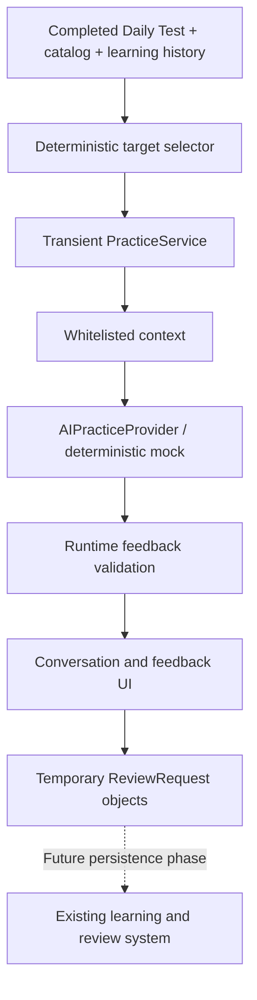

# Mock AI practice

Daily Test completion offers **Practice with AI**, alongside the existing Start another test and View Learned actions. All three modes use typed input in this phase. The screen identifies the provider as a mock; no network service, microphone, transcription, key, billing, or backend is involved. Guests and accounts can both use the mock, including offline.

## Architecture



New modules in `src/aiPractice/`:

| Module | Responsibility |
| --- | --- |
| `practiceModel.ts` | Modes, target/turn/feedback/session types, allowed transitions, derived progress |
| `targetWordSelector.ts` | Pure, deterministic selection from a completed quiz |
| `contextBuilder.ts` | Explicit provider-safe vocabulary and learning projection |
| `provider.ts` | Provider-neutral asynchronous contract |
| `mockProvider.ts` | Scripted prompts, phrase recognition, bounded example corrections |
| `feedbackValidator.ts` | Runtime trust boundary and locally derived recommendations |
| `practiceService.ts` | Observable in-memory state, deterministic answer checks, cancellation, orchestration |
| `reviewRequest.ts` | Pure, validated explicit review-request construction |
| `AIPractice.tsx` | Mode setup and typed practice UI |
| `PracticeFeedback.tsx` | Outcomes, corrections, and temporary review selection |

`App.tsx` coordinates entry from `DailyTest.tsx`. No new state library is used. `PracticeService` follows the existing subscription/getSnapshot convention, and React uses `useSyncExternalStore`. Its constructor accepts a provider, clock, and ID generator. It has no repository, storage, authentication, or sync dependency.

## Selection and snapshots

Select at most eight distinct words from completed quiz results which are still present in the current catalog. Selection does not expand into unrelated vocabulary. Fewer than five candidates are valid; zero candidates leaves a return-to-results message.

Priority is incorrect typed answers, weak words, newly learned words, due words, then other correct answers. Weak means directional difficulty above 50, or prior misses with fewer than two consecutive Known assessments, matching the existing adaptive selection criteria. Ties use descending directional difficulty, quiz order, then ID. Time is an explicit input.

Targets preserve quiz direction and a deep copy of the frozen question snapshot, including accepted answers and strict/legacy matching rule. Later edits do not rewrite what this practice was based on. Deleted/hidden targets invalidate active practice. Existing `selectQuestions`, scoring, Known/Didn't know assessment, history, and review scheduling are unchanged. Difficulty labels remain New/Easy/Medium/Hard/Very Hard and do not represent CEFR proficiency.

## Context and provider boundaries

`buildPracticeContext` constructs each property explicitly. It includes target IDs, English, Turkish meanings, English alternatives, optional example/part of speech, direction, difficulty, quiz evidence, and relevant directional counters. It excludes account IDs, auth tokens, queue contents, devices, unrelated words, tags, and full history.

The provider receives that context plus finalized learner/tutor turns. Turn identifiers allow evidence references; turn text is user-supplied content, not trusted instructions. A future provider must treat vocabulary examples and learner text as data too. This structural whitelist cannot prevent a learner from voluntarily typing personal information.

`AIPracticeProvider.prepare` returns an untrusted tutor message; `respond` returns an untrusted message and full per-target feedback; `finish` returns untrusted final feedback. Calls accept an abort signal; disposal releases provider resources. There are no SDK types. Use `AIPractice`'s optional `providerFactory` prop for test injection; production currently always constructs `MockPracticeProvider`.

## Mock semantics and validation

Voice Answer bypasses provider evaluation entirely and uses existing `questionMatches`, including Turkish spelling, alternate meanings, phrases, and historical matching rules. Before submission, the UI hides answer-bearing target labels. There is no speech capture.

Use the Word prompts for an English sentence. Conversation uses short contextual cues for a small known vocabulary set and a generic situation prompt for other words. Whole-phrase, Unicode-aware boundaries prevent substring matches; explicit English alternatives are recognized. Each response is associated with the prompted target, and may also demonstrate other selected words. The next prompt moves to an unattempted target.

Feedback separates retrieval (`recognized`, `missing`, `unassessed`), semantics (`acceptable`, `inappropriate`, `unassessed`), and grammar (`correct`, `needsCorrection`, `unassessed`). Summary outcomes are `correct`, `partial`, `needsPractice`, or `notAttempted`.

**Correct retrieval is not a claim that an arbitrary sentence is semantically or grammatically correct.** The mock generally leaves both dimensions unassessed. A supported “I want achieve my goal(s)” example recognizes vocabulary and semantic usage while proposing “want to achieve.” A supported “I achieve to school” example demonstrates partial vocabulary usage and a separate vocabulary correction. These are scripted examples, not general language analysis. Mock recognition does not stem words or infer synonyms.

`validateFeedback` validates every provider result before it reaches UI state. It requires exactly one outcome per target; rejects unknown/non-target IDs, duplicate outcomes, invalid enums, oversized/malformed fields, unsupported evidence and corrections, contradictory success/failure states, and unsafe review recommendations. Evidence must name finalized learner turns; correction originals must occur in that evidence. Extra properties are stripped. Counts and suggested IDs are derived locally. Only partial/needsPractice vocabulary outcomes suggest review; a grammar-only issue does not.

Validation establishes structural consistency, not factual certainty. Future provider evaluations remain fallible and cannot directly alter learning records.

## Lifecycle, persistence, and review requests

Preparation transitions to ready. Submission transitions through processing back to ready. Ending validates feedback, then Finish completes the session. Cancellation/failure are terminal. Listening and tutorSpeaking statuses are reserved for future adapters. Duplicate/in-flight submissions are ignored; abort/disposal prevents late provider responses from updating state.

Practice is limited to eight targets, at most sixteen learner turns, and 2,000 characters per response. Only finalized turns enter service state; drafts remain React state. Progress derives from validated outcomes. Source changes, navigation, account-scope changes, target removal, and unmount dispose the active service. Existing pronunciation stops on entry. Reload does not resume mock practice; the completed quiz remains intact.

**Everything introduced here is transient:** drafts, finalized turns, outcomes, feedback, corrections, and staged review requests. Nothing enters localStorage, IndexedDB, the account outbox, mastery counters, activity totals, or the Review queue.

`ReviewRequest` contains `wordId`, direction, request timestamp, `source: 'aiPractice'`, and source practice-session ID. `createReviewRequests` accepts only selected suggested targets still available in the current catalog. The service stages these idempotently in memory. The UI explicitly states that they are temporary and discarded on leaving practice. It does not pretend that they were added to Review.

Future persistence work must add an explicit learning command and durable review-request lifecycle, validate identity mapping, extend versioned local/account encoding and RPCs, address deletion/reset/import/concurrent-device behavior, and define when a normal review satisfies a request. It must not implement review requests with `recordAssessment(..., false)`. No schema or sync protocol is changed in this phase.

## Future voice and real AI

A future adapter can attach microphone/transcription events to the reserved listening/speaking states and submit finalized transcripts through the same service. Keep partial transcripts, tokens, audio chunks, and connection state transient. Avoid overlapping existing pronunciation with recording.

Real provider implementation requires a trusted authenticated backend, server-side secrets, bounded usage, timeout/shutdown behavior, and official API documentation verification at implementation time. Browser credentials, if needed, must be temporary. No permanent key belongs in Vite variables. No provider API names or model choices are assumed here.

## Development and checks

No new dependencies or environment variables are needed to run the mock:

```sh
npm ci
npm run dev
npm test
npm run lint
npm run build
npm run test:browser
npx playwright test --config=playwright.ai.config.ts
```

Use a Node build with native TypeScript support (the README's Node 22.18+ or Node 24 requirement). Some system Node builds disable TypeScript support even when their version is recent enough.

Playwright retains the repository's default `msedge` channel. Machines with Chromium instead can install the matching version and select it explicitly:

```sh
npx playwright install chromium
PLAYWRIGHT_CHANNEL=chromium npm run test:browser
PLAYWRIGHT_CHANNEL=chromium npx playwright test --config=playwright.ai.config.ts
```

`tests/aiPractice.test.mjs` covers selection/privacy, validation, matching, state transitions, semantic/grammar separation, deterministic mock behavior, late responses, cancellation/failures, review requests, and unchanged account storage/outbox.

`tests/pwa/aiPractice.spec.ts` exercises the production post-quiz flow, all modes, zero storage writes, optional entry, cancellation/navigation, feedback, review staging, refresh, accessibility, and mobile layout. `playwright.ai.config.ts` runs the separate dev-only failure fixture in `tests/browser/aiPractice.html`; it is not included in the production build and supplies no production failure controls.

## Implementation completion report

Implemented the complete mock-only cycle: completed Daily Test → optional mode selection → typed practice → validated structured feedback → temporary review-request selection. Existing completion actions remain available. Cancellation, failure, and refresh preserve the completed quiz. All new practice information stays in memory.

Created files:

```text
AI_PRACTICE.md
playwright.ai.config.ts
src/aiPractice/AIPractice.tsx
src/aiPractice/PracticeFeedback.tsx
src/aiPractice/contextBuilder.ts
src/aiPractice/feedbackValidator.ts
src/aiPractice/mockProvider.ts
src/aiPractice/practiceModel.ts
src/aiPractice/practiceService.ts
src/aiPractice/provider.ts
src/aiPractice/reviewRequest.ts
src/aiPractice/targetWordSelector.ts
tests/ai-browser/failure.spec.ts
tests/aiPractice.test.mjs
tests/browser/aiPractice.html
tests/browser/aiPractice.tsx
tests/pwa/aiPractice.spec.ts
```

Modified files:

```text
README.md
playwright.config.ts
src/App.css
src/App.tsx
src/DailyTest.tsx
tests/pwa/app.spec.ts
```

The existing browser config and persistent-browser test now accept `PLAYWRIGHT_CHANNEL`, retaining `msedge` as the default. This permits Chromium verification on this machine; no existing assertions were removed or weakened. CSS changes are scoped to the new practice UI, including contrast and mobile checkbox fixes found during verification. No dependency manifest, lockfile, database migration, sync code, or environment-secret file changed.

Verification performed:

| Command/check | Result |
| --- | --- |
| `npm ci --no-audit --no-fund` | Installed locked dependencies after network access was granted |
| `npm test` with temporary Node 24 on PATH | All 18 test files passed, including existing PGlite database/security/sync tests |
| Node 24 running `tests/aiPractice.test.mjs` directly | All 17 new domain tests passed; rerun after final validator changes |
| `npm run lint` | Passed with no warnings |
| `npm run build` | TypeScript and production/PWA build passed |
| `PLAYWRIGHT_CHANNEL=chromium npm run test:browser` | All 16 production browser tests passed |
| `PLAYWRIGHT_CHANNEL=chromium npx playwright test --config=playwright.ai.config.ts` | Isolated provider-failure test passed |
| `PLAYWRIGHT_CHANNEL=chromium npm run test:browser -- tests/pwa/aiPractice.spec.ts` | All 5 targeted tests passed again after final checkbox/validator changes |
| Axe, 320px overflow/checkbox assertions, keyboard submission/focus, mobile screenshot inspection | Passed for the new feedback flow |
| `git diff --check` | Passed |

The system Node 22 build lacked native TypeScript support; a temporary Node 24 runtime was used without changing project dependencies. Playwright's expected Chromium revision was installed. Initial sandbox port restrictions and missing-browser errors were resolved; no browser checks were skipped. Edge itself was not available, so browser results are for Chromium.

Known limitations are intentional for this stage: mock language judgments are scripted and limited, no microphone or real AI exists, no practice resume/history is stored, and staged review requests disappear when practice ends. Persistent learning evidence/review requests, schema/sync migration, authenticated provider endpoints, quotas, voice capture, and official OpenAI integration remain future phases. Implementation stopped at this boundary.
